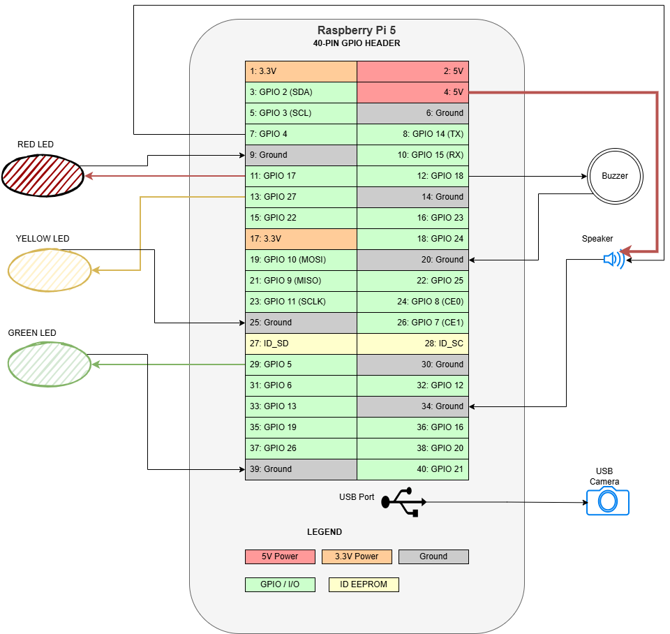

# CrowdLens — Hardware Setup

## 1. Pin Assignment Table

|   Component         |   GPIO PIN   |   Physical pin   |   Role in code      |
|---------------------|--------------|------------------|---------------------|
|   Green LED         |   GPIO 5     |   Pin 29	        |   No traffic / safe |
|   Yellow LED	      |   GPIO 27	 |   Pin 13         |   Crowding Warning  |
|   Red LED           |   GPIO 17	 |   Pin 11	        |   Stampede Alert    |
|   Passive Buzzer    |   GPIO 18	 |   Pin 12		    |   Stampede Alert    |
|   Speaker	          |   GPIO 4	 |   Pin 7	 	    |   Voice Messages    |
|   USB Camera	      |   USB port   |	                |   Frame Capture     |

---

## 2. Wiring Diagram

